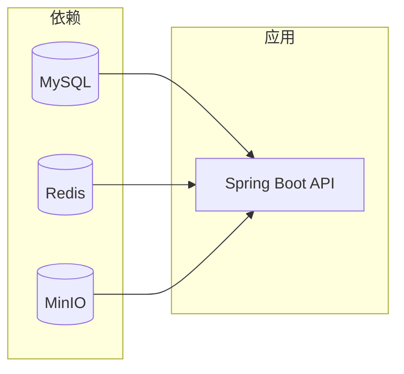
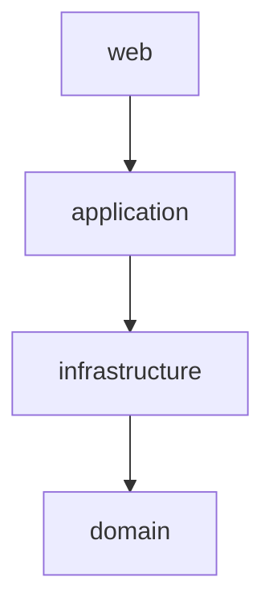

<p align="center">
  <a href="https://adoptium.net/"></a>
  <a href="https://spring.io/projects/spring-boot"></a>
  <a href="https://maven.apache.org/"></a>
</p>

<h1 align="center">Java API · backend-java</h1>

<p align="center">多模块 Spring Boot 服务 · Session + Redis · OpenAPI · Flyway</p>

---

## 目录

| 区块 | 内容 |
|:--|:--|
| [速览](#速览) | 文档链接、端口、一句话启动 |
| [工作目录](#工作目录) | 应在哪执行 `mvn` / `docker` |
| [环境要求](#环境要求) | JDK、Maven、Docker |
| [第一次启动](#第一次启动) | 依赖 → 环境变量 → 运行 → 验证 |
| [日常命令](#日常命令) | 停止、打包、Jar 路径 |
| [测试 API](#测试-api) | Swagger、curl、PowerShell、Maven |
| [常见问题](#常见问题) | 排错表 |
| [附录](#附录) | Worker、模块、范围、运维 |
| [Word 说明](#word-版说明同一目录) | 与 README 同步的 `.docx` 及生成命令 |
| [**技术框架与架构示意图（《选型》）**](docs/watermark-java-backend-tech-selection.md) | 纯文本容器/模块图、选型、队列契约、与 §19 差异 |
| [**生产部署与配置**](docs/DEPLOY-SERVER.md) | 服务器步骤、env、systemd、Nginx（示例 **loadsadar.asia**） |
| [**生产检查 · 问题 · 测试**](docs/REQUIREMENTS-CHECKLIST-AND-TEST-CASES.md) | 上线打勾清单、已知环境风险、需求对照（R 表）、测试用例与 Maven 命令 |
| [**API 契约（新增）**](docs/API-CONTRACT.md) | 核心接口示例、错误模型、幂等与版本策略 |
| [**安全基线（新增）**](docs/SECURITY-BASELINE.md) | 认证、CSRF/CORS、Cookie、密钥与最小权限 |
| [**运行手册 Runbook（新增）**](docs/RUNBOOK.md) | 告警排查、故障止血、回滚与恢复流程 |
| [**SLO/SLA（新增）**](docs/OPERATIONS-SLO-SLA.md) | 可用性与时延目标、错误预算、告警阈值 |
| [**架构决策记录 ADR（新增）**](docs/adr/) | Session/JWT、队列、前后端形态、存储策略决策 |

---

## 速览

| 项目 | 说明 |
|:--|:--|
| 工程形态 | **Maven 多模块**；可执行入口在子模块 **`web`** |
| **Word 版** | 同目录 **`Watermark-Java-API-Guide.docx`**（中文排版）；生成命令见 [Word 版说明](#word-版说明同一目录) |
| **公网部署** | **步骤与配置**见 **[docs/DEPLOY-SERVER.md](docs/DEPLOY-SERVER.md)**；**检查表、问题汇总、用例**见 **[docs/REQUIREMENTS-CHECKLIST-AND-TEST-CASES.md](docs/REQUIREMENTS-CHECKLIST-AND-TEST-CASES.md)**（`deploy/` 下 Nginx / systemd / 环境变量模板） |
| **部署前自检** | 须在 **`backend-java`** 下执行，或从仓库根用 **`./backend-java/scripts/verify-config.sh`**。例：**`./backend-java/scripts/verify-config.sh --env-file /path/to/watermark-api.env --strict`**（可选 **`--api-url https://api.loadsadar.asia`**）；Windows：**`powershell -File backend-java/scripts/verify-config.ps1 -EnvFile ... -Strict`**；详见部署文档 |
| **设计 / 选型** | **[docs/watermark-java-backend-tech-selection.md](docs/watermark-java-backend-tech-selection.md)**（与部署文档同目录；仓库根 `docs/` 下为迁移说明 stub） |
| 默认端口 | **8080**（未改 `server.port`） |
| OpenAPI | <http://localhost:8080/v3/api-docs> |
| Swagger | <http://localhost:8080/swagger-ui.html> |
| 水印算法 | 仓库 [`watermark/`](../watermark)（Python）；异步消费见 [可选 Worker](#可选-python-异步-worker) |

**技术栈**：Spring Boot 3.2 · Java 17 · Spring Security 6（BCrypt）· JPA + Flyway + MySQL · Spring Session Data Redis · springdoc-openapi · AWS SDK v2 S3（MinIO / COS）· 腾讯云 STS。

### 文档分工（唯一来源）

| 主题 | 单一权威文档 | 维护规则 |
|:--|:--|:--|
| 技术架构与选型 | [`docs/watermark-java-backend-tech-selection.md`](docs/watermark-java-backend-tech-selection.md) | 架构图、选型、关键决策只在此文维护 |
| 生产部署与配置 | [`docs/DEPLOY-SERVER.md`](docs/DEPLOY-SERVER.md) | 部署命令、systemd、Nginx、env 只在此文维护 |
| 上线检查与测试 | [`docs/REQUIREMENTS-CHECKLIST-AND-TEST-CASES.md`](docs/REQUIREMENTS-CHECKLIST-AND-TEST-CASES.md) | 检查表、风险、R 对照、测试用例只在此文维护 |
| API 契约 | [`docs/API-CONTRACT.md`](docs/API-CONTRACT.md) | 请求响应样例、错误码、幂等与版本策略 |
| 安全策略 | [`docs/SECURITY-BASELINE.md`](docs/SECURITY-BASELINE.md) | 认证、CSRF/CORS、Cookie 与敏感信息治理 |
| 运维值班 | [`docs/RUNBOOK.md`](docs/RUNBOOK.md) | 告警、排障、回滚、恢复 SOP |
| 服务目标 | [`docs/OPERATIONS-SLO-SLA.md`](docs/OPERATIONS-SLO-SLA.md) | SLI/SLO、错误预算、告警阈值与值班响应 |
| 架构决策历史 | [`docs/adr/`](docs/adr/) | 重大决策采用 ADR 增量沉淀，禁止口头约定 |

### 最短路径（复制即用）

在 **`backend-java`** 目录（见 [工作目录](#工作目录)）：

```bash
docker compose up -d
mvn -pl web -am spring-boot:run
```

无 Docker 时跳过第一行，自行保证 MySQL / Redis / MinIO 与配置一致即可。



### Word 版说明（同一目录）

需要 **Word（.docx）** 排版阅读时，在本目录执行：

```bash
pip install python-docx
python scripts/gen_readme_docx.py
```

将生成 **`Watermark-Java-API-Guide.docx`**（与 `README.md` 内容对齐；协作仍以 Markdown 为准，改文档后请重新运行脚本同步 Word）。

---

## 工作目录

所有 **`mvn`**、**`docker compose`** 命令默认在 **本 README 所在目录** 执行，即 Maven 父工程根目录：

| 场景 | 路径示例 |
|:--|:--|
| 相对仓库根 | `watermarking/backend-java` |
| Windows 绝对路径 | `E:\code\watermarking\backend-java` |

```powershell
Set-Location E:\code\watermarking\backend-java
```

> **提示** · 若不在该目录，易出现 `Could not find the selected project in the reactor: web`。在任意目录也可使用：  
> `mvn -f E:\code\watermarking\backend-java\pom.xml -pl web -am …`

---

## 环境要求

| 项 | 要求 |
|:--|:--|
| JDK | **17**（完整 JDK，`JAVA_HOME` 指向 JDK） |
| Maven | **3.9+** |
| Docker | **推荐**：`docker compose` 一键起依赖；未安装或未进 PATH 时见 [第一次启动 → 无 Docker](#无-docker) |

---

## 第一次启动

### 步骤 A · 启动依赖（MySQL + Redis + MinIO）

```bash
docker compose up -d
```

| 服务 | 端口 | 说明 |
|:--|:--:|:--|
| MySQL | 3306 | 库 **`watermark`** · 用户 **`root`** · 密码 **`devpass`** |
| Redis | 6379 | 无密码（与 `application-dev.yml` 一致） |
| MinIO API | 9000 | **`minioadmin`** / **`minioadmin`** · 桶 **`watermark`**（`minio-init`） |
| MinIO 控制台 | 9001 | Web 管理 |

首次启动后请等待 **MySQL 就绪**（约数十秒）再启动 Java，避免连库失败。

#### 无 Docker

PowerShell 若提示 **无法将「docker」项识别为名称**，说明未安装 Docker 或未加入 PATH。

| 做法 | 操作 |
|:--|:--|
| 使用 Docker | 安装 [Docker Desktop for Windows](https://docs.docker.com/desktop/install/windows-install/)，完成后 **重启或重新登录**，新终端执行 `docker --version` 无误后再 `docker compose up -d` |
| 不用 Docker | 本机自行安装 **MySQL 8、Redis、MinIO**（或先只起 MySQL + Redis 测登录），与 `application-dev.yml` 或 `WM_DATASOURCE_*` / `WM_REDIS_*` / `WM_MINIO_*` 对齐，然后直接进入 **步骤 C** |

### 步骤 B · 环境变量（可选）

不配也可运行：`web/src/main/resources/application-dev.yml` 已与上述 Compose 对齐。

```powershell
$env:WM_DATASOURCE_URL = "jdbc:mysql://localhost:3306/watermark?useUnicode=true&characterEncoding=utf8&serverTimezone=UTC"
$env:WM_DATASOURCE_USERNAME = "root"
$env:WM_DATASOURCE_PASSWORD = "devpass"
$env:WM_REDIS_HOST = "localhost"
$env:WM_REDIS_PORT = "6379"
$env:WM_PROFILE = "dev"
```

更多项见 `web/src/main/resources/application.yml`（`wm.storage`、`wm.jobs`、限流、保留期等）。

### 步骤 C · 启动 API（务必带 `-pl web`）

```bash
mvn -pl web -am spring-boot:run
```

| 参数 | 含义 |
|:--|:--|
| `-pl web` | 仅对 **`web`** 执行 `spring-boot:run`（`main` 在此模块） |
| `-am` | 同时构建 **`web`** 依赖的 `application`、`infrastructure`、`domain` |

> **注意** · **不要**在根目录执行裸命令 **`mvn spring-boot:run`**（父 POM 无 `main`，会报 `Unable to find a suitable main class`）。  
> 父 `pom.xml` 已对 `spring-boot-maven-plugin` 设 **`skip=true`**，`web/pom.xml` 为 **`skip=false`**，因此必须使用 **`-pl web -am`**。

### 步骤 D · 验证

| 用途 | URL |
|:--|:--|
| Swagger | <http://localhost:8080/swagger-ui.html> |
| OpenAPI JSON | <http://localhost:8080/v3/api-docs> |
| 健康检查 | <http://localhost:8080/actuator/health> |
| Prometheus | <http://localhost:8080/actuator/prometheus> |

---

## 日常命令

```bash
docker compose down
mvn -pl web -am package -DskipTests
```

打包产物示例（版本以 `pom.xml` 为准）：**`web/target/web-0.1.0-SNAPSHOT.jar`**

---

## 测试 API

### Swagger（推荐）

1. 确认 API 已启动。  
2. 打开 <http://localhost:8080/swagger-ui.html>。  
3. 依次 **`POST /api/v1/auth/register`** → **`POST /api/v1/auth/login`**，浏览器会保存 **`WMSESSIONID`**，同页后续请求自动带登录态。  
4. 再测文件、STS、`files/complete`、任务等。

多数业务 **POST** 已豁免 CSRF；**`POST /api/v1/auth/logout`** 仍需 **`X-XSRF-TOKEN`** 与 Cookie **`XSRF-TOKEN`**。

<details>
<summary><strong>curl（bash / Git Bash）</strong></summary>

```bash
BASE=http://localhost:8080

curl -s -c cookies.txt -H "Content-Type: application/json" \
  -d '{"username":"demo","email":"demo@example.com","password":"secret12"}' \
  "$BASE/api/v1/auth/register"

curl -s -c cookies.txt -b cookies.txt -H "Content-Type: application/json" \
  -d '{"usernameOrEmail":"demo","password":"secret12"}' \
  "$BASE/api/v1/auth/login"

curl -s -b cookies.txt "$BASE/api/v1/files?page=0&size=10"
```

</details>

<details>
<summary><strong>PowerShell（请用 curl.exe，避免 Invoke-WebRequest 别名）</strong></summary>

```powershell
curl.exe -s -c cookies.txt -H "Content-Type: application/json" `
  -d "{\"username\":\"demo\",\"email\":\"demo@example.com\",\"password\":\"secret12\"}" `
  http://localhost:8080/api/v1/auth/register
```

</details>

### Maven 自动化测试

```bash
mvn -pl web -am test
mvn -pl web -am verify
```

| 类型 | 说明 |
|:--|:--|
| 单元测试 | 如 `IdempotencyKeyHasherTest`，不依赖 Docker |
| `EndToEndWatermarkFlowTest` | Testcontainers（MySQL + Redis + MinIO）；本机无 Docker 时 **跳过**；CI 上跑全量 |

CI：`.github/workflows/backend-java-ci.yml`（`mvn -pl web -am verify`）。

---

## 常见问题

| 现象 | 处理 |
|:--|:--|
| `Could not find the selected project in the reactor: web` | `cd` 到 **`backend-java`**，或 `-f …/backend-java/pom.xml` |
| `Unable to find a suitable main class` | 使用 **`mvn -pl web -am spring-boot:run`**，勿裸跑 **`mvn spring-boot:run`** |
| 数据库连接失败 | 确认 MySQL 已起且就绪；检查 **`WM_DATASOURCE_*`** |
| Redis 连接失败 | 确认 Redis 已起；检查 **`WM_REDIS_*`** |
| 对象存储接口失败 | 确认 MinIO 已起；dev 默认 **`WM_MINIO_ENDPOINT=http://127.0.0.1:9000`** |

---

## 附录

### 可选：Python 异步 Worker

`POST /api/v1/jobs/watermark` 写入 Redis Stream；在 **含 `watermark` 包的仓库根** 执行：

```bash
python -m watermark.worker.redis_stream_worker
```

与 Java 共用 **`SQLALCHEMY_DATABASE_URI`**、**`WM_REDIS_*`**、**`WM_JOBS_*`**、**`WM_MINIO_*` 或 COS**。详见 `watermark/worker/redis_stream_worker.py` 文件头。

### 与既有 Python / 旧版数据共用 MySQL

- Java 使用 **BCrypt** 与 **LegacyAwarePasswordEncoder**（Werkzeug 旧哈希可在登录后升级）。  
- 共用库时注意 **Flyway 顺序** 与备份策略。

### Maven 模块



| 模块 | 职责 |
|:--|:--|
| `domain` | JPA 实体 |
| `infrastructure` | Flyway、Repository、S3/MinIO/COS STS、Redis 任务等 |
| `application` | 认证、文件、任务、管理等 |
| `web` | `WatermarkApplication`、REST、Prometheus |

### 功能范围

实现与 **《选型》分阶段里程碑（§16）** 及 OpenAPI 对齐的主要能力；**具体路径与字段以 OpenAPI 为准**。

### 运维与后续决策

- Session 与 JWT 长期方案（当前 **Session + Redis**）。  
- 生产是否继续匿名开放 **`/actuator/prometheus`**（建议网关或 IP 限制）。  
- 可选：`mvn org.owasp:dependency-check-maven:check`、Snyk、Jib / Buildpacks 镜像。
